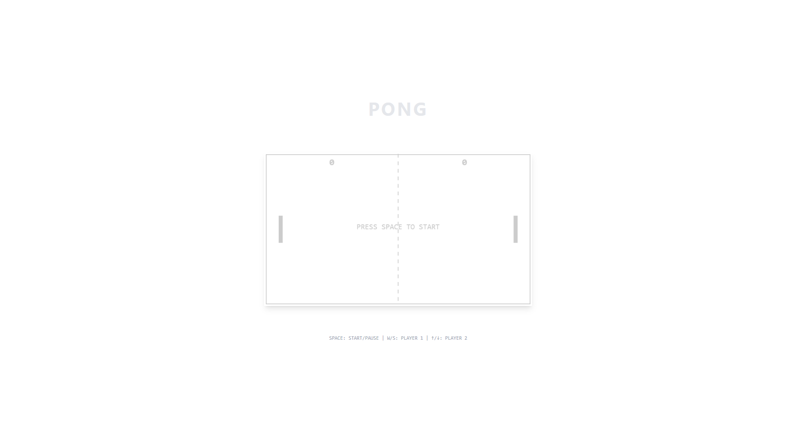

# 🏓 React Pong Game

A classic Pong game built with React, Vite, TypeScript, and Canvas. Features smooth physics, multiplayer controls, and sound effects.

 <!-- Add a screenshot later -->

## 🚀 Features

- **Multiplayer controls** (W/S for Player 1, ↑/↓ for Player 2)
- **Realistic ball physics** with paddle spin
- **Score tracking** with sound effects
- **Pause/resume** gameplay (SPACEBAR)
- Responsive design (works on desktop/mobile)

## 🛠️ Technologies

- React 18 + TypeScript
- Canvas API for rendering
- Vite (for fast builds) <!-- Replace with your bundler if different -->
- CSS (Tailwind optional)

## 📦 Installation

1. Clone the repo:

   ```bash
   git clone https://github.com/arcadesproject/react-pong.git

2. Install dependencies:

    ```bash
    npm install

3. Run server

    ```bash
    npm run dev

4. Open <http://localhost:3000>
